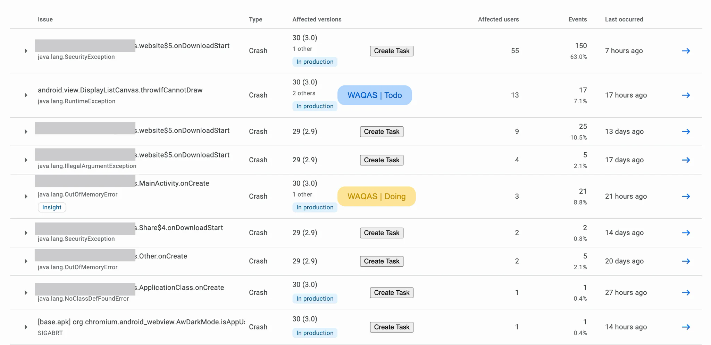

## AsanaPlaySync Chrome Extension

This extnesion will show the status of crash in Google Play Console from Asana,

## How

When a page is loaded in Google Play Console,

- It will read the DOM and fetch title of each crash and the link to Crash Details page,
- Then it will use Asana API to search for that link,
- If the link is found in any Asana task, means the task is already created and it will show a text containing the section name the task is in like `Todo` `Doing` `Completed` along with the person name the task is assigned to. Clicking the link would open that specific task in Asana in new Window
- If the link is not found then it show a button to create task,
- When create task button is clicked, it will create a new task and assign it to the person whos account was use to get the API Keys, I will update this functionality later to make it unassinged.



## Setup

Follow these steps to set it up and running:

1. Create a `config.js` file in the root directory and paste the following in it

```

globalThis.config = {
  customFieldId: {
    //this is the custom field id of gpc in the asana board
    //you need to have id of the custom field to insert data into that
    //to get the id, create a custom field in the task first,
    //then get the task details using api explorer here:
    //https://developers.asana.com/reference/gettask
    gpc: "",
  },

  //gid can be obtained by visitng the url:
  //https://app.asana.com/api/1.0/workspaces?opt_pretty
  gid: "",

  //it can be created by visiting:
  //https://app.asana.com/0/my-apps
  //the provided PAT is for "play-console"
  //if the name is required at some point
  personalAccessToken:
    "",

  //just open the project in asana and you will see the
  //id in url
  projectId: "",

  //these are the ids of seaction,
  //can be obtained by running fetchSectionsInProject script in asana.js
  sections: {
    todo: "",
    doing: "",
    completed: "",
  },
};

```

Follow the instructions in comments to get relevent IDs

### Remember:

Your project in Asana must have a specific field named `gpc` means Google Play Console, that will contain the link the to crash detail page in Google Play Console and will also work as the unique id of the task.

## Running the Extension

As of now, it only supports Chrome, will update it for Safari as well soon.

1. Visit `chrome://extensions/`
2. Click `Load unpacked` in top left corner
3. Selec the directory where you clonned the extension.

Cheers.
